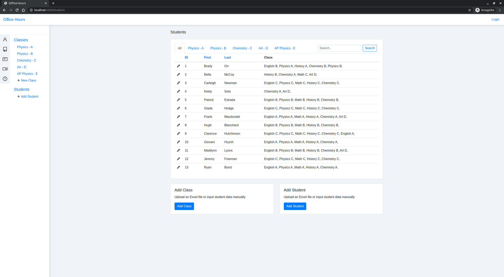
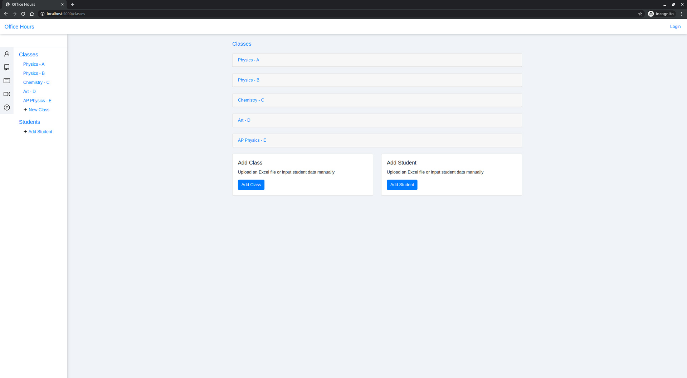
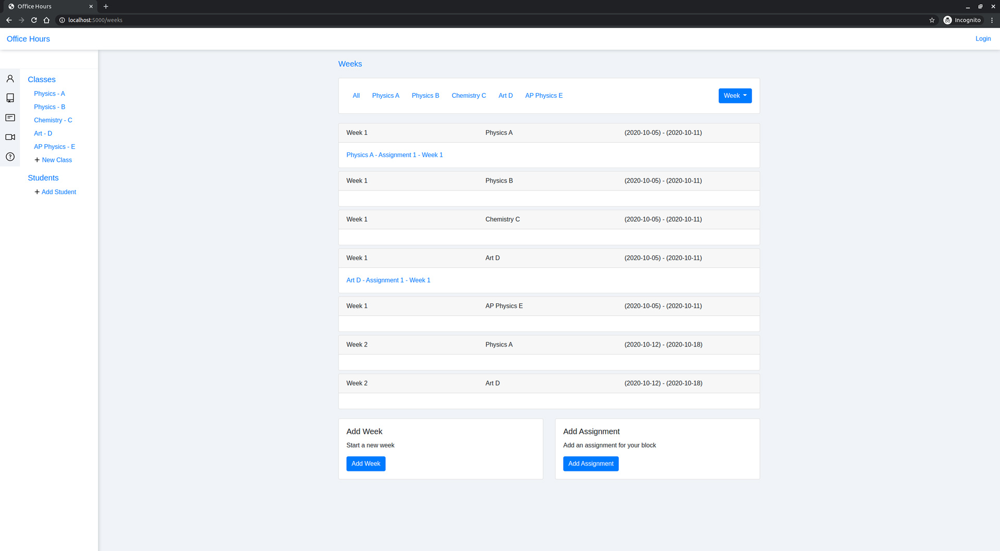
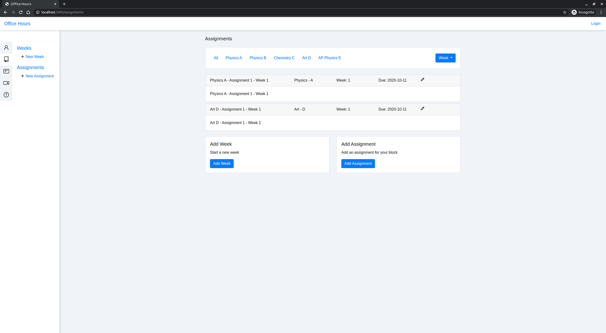
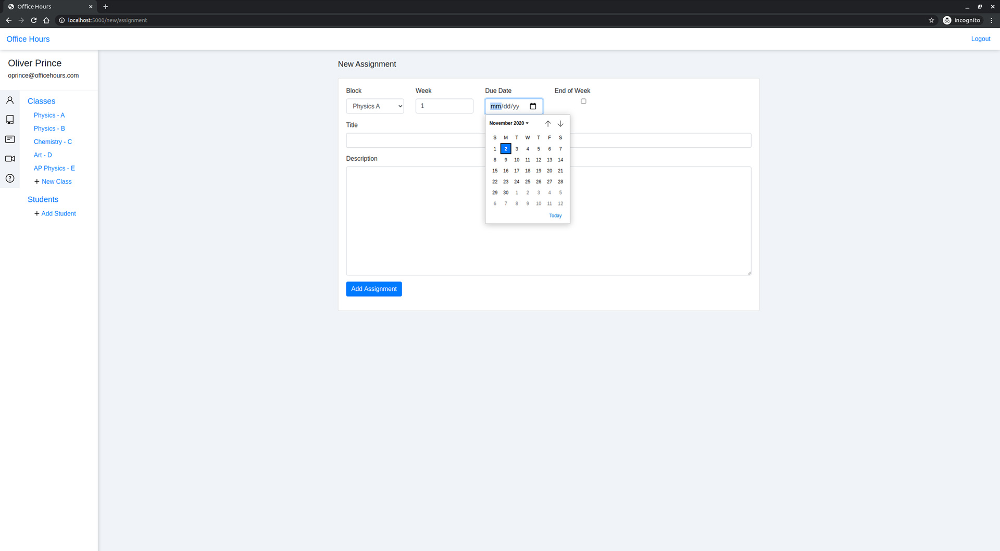

# Office Hours Web Application

## About

> Office House is an application designed to help teachers better manage their online classes.







## Setup (local)
### Step 1:
```
pip3 install -r requirements.txt
python3 run.py
```
### Step 2:
* Browse to localhost:5000 in your browser.

## Features
*Everything is stored on your local machine using SQLAlchemy.*
* Create your classes
* Add students to your classes
* Add weeks and assignments unique to your classes
* Edit your students, classes, weeks, and assignments

## Technologies


* SQLAlchemy
